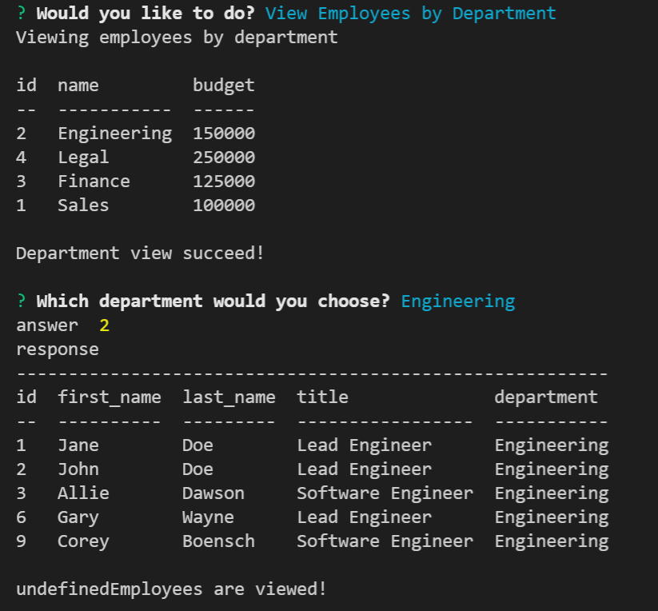

  # Track My Team
   
  
  ## User Story
  ```
  AS A business owner
  I WANT to be able to view and manage the departments, roles, and employees in my company
  SO THAT I can organize and plan my business
  ```
  ## Acceptance Criteria
  ```
  GIVEN a command-line application that accepts user input
  WHEN I start the application
  THEN I am presented with the following options: view all departments, view all roles, view all employees, add a department, add a role, add an employee, and update an employee   role
  WHEN I choose to view all departments
  THEN I am presented with a formatted table showing department names and department ids
  WHEN I choose to view all roles
  THEN I am presented with the job title, role id, the department that role belongs to, and the salary for that role
  WHEN I choose to view all employees
  THEN I am presented with a formatted table showing employee data, including employee ids, first names, last names, job titles, departments, salaries, and managers that the       employees report to
  WHEN I choose to add a department
  THEN I am prompted to enter the name of the department and that department is added to the database
  WHEN I choose to add a role
  THEN I am prompted to enter the name, salary, and department for the role and that role is added to the database
  WHEN I choose to add an employee
  THEN I am prompted to enter the employee’s first name, last name, role, and manager, and that employee is added to the database
  WHEN I choose to update an employee role
  THEN I am prompted to select an employee to update and their new role and this information is updated in the database
  ```
  


  https://user-images.githubusercontent.com/87203701/158032477-6a778d59-762c-4584-bf6f-75fd5f86e438.mp4

  ## Table-of-Contents

  * [Description](#description)
  
  * [Installation](#installation)
  
  * [License](#license)
    
  * [Contributing](#contributing)

  * [Questions](#questions)
  
  ## [Description](#table-of-contents)

  This is a simple program built to view and manage your employees and where they work in your business as well as other information such as Salary, and their Manager.

  ## [Installation](#table-of-contents)

  To get this on your local machine simply clone this repository, `npm i` to install all packages needed, navigate to `server.js` and update `Line 15 && Line 18` with your MySQL     username and password. Once this is updated and saved, open your terminal and use command `mysql -u root -p` input your password and use commands `CREATE DATABASE employeesDB` , `SOURCE sql/schema.sql` and `SOURCE sql/seed.sql`. At this point you have etablished connection to MySQL, Created and Seeded your database and ready to use the program. Insuring that    you have `exit` the mysql command line and are back on your normal terminal use command `npm start` and you are off to the races!

  
  

  ## [License](#table-of-contents)

  The application is covered under the following license:

  
  [mit](https://choosealicense.com/licenses/mit)
    
    
  ## [Contributing](#table-of-contents)
  
  
  Thank you for your interest in helping out; however, I will not be accepting contributions from third parties.
    
    
  ## [Questions](#table-of-contents)

  Please contact me using the following links:

  [GitHub](https://github.com/cboensch6505)

  [Email: cboensch6505@gmail.com](mailto:cboensch6505@gmail.com)
